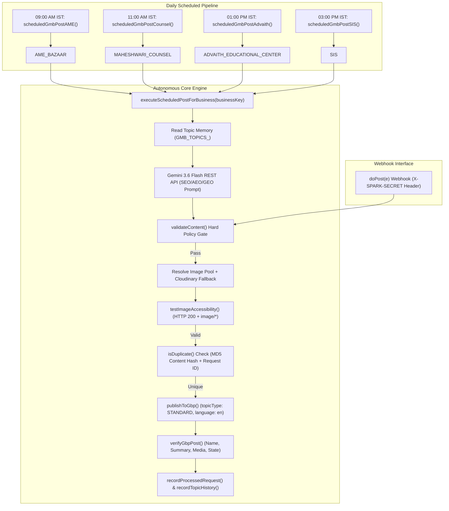

# Multi-Business Google Business Profile (GMB) Automation Engine

A robust, self-contained Google Apps Script automation engine that generates, validates, schedules, publishes, and verifies authentic, localized Google Business Profile (GBP) posts daily for four distinct verified business profiles.

---

## 1. Verified Production Business Targets

| Business Key | Business Name | Account ID | Location ID | Status | Daily Schedule (IST) |
|---|---|---|---|---|---|
| **`AME_BAZAAR`** | AME Bazaar - Family Garment Store | `107856377351216824945` | `16134813121256220692` | `VERIFIED` & `LIVE` | **09:00 AM IST** |
| **`MAHESHWARI_COUNSEL`** | Maheshwari Counsel \| Advocates & Legal Consultants | `107856377351216824945` | `1571247269233718336` | `VERIFIED` | **11:00 AM IST** |
| **`ADVAITH_EDUCATIONAL_CENTER`** | Advaith Educational Centre | `107856377351216824945` | `12195894669850420443` | `VERIFIED` | **01:00 PM IST** |
| **`SIS`** | SARASWATI INTERNATIONAL SCHOOL | `107856377351216824945` | `4069269303360601513` | `VERIFIED` | **03:00 PM IST** |

---

## 2. System Architecture

The engine operates on two complementary execution pathways:
1. **Autonomous Scheduled Daily Pipeline (Option A)**: 4 staggered daily time-driven triggers execute business-specific Gemini generation, policy checks, image resolution, duplicate locking, and GBP publication.
2. **Webhook API Receiver (`doPost`)**: Allows external orchestrators or emergency triggers to post on-demand via authenticated requests.



---

## 3. SEO / AEO / GEO Content Strategy

Each business receives 100% independent, dedicated content targeting local relevance without copying website or social media copy:

### **AME Bazaar (`AME_BAZAAR`)**
* **Themes**: Family fashion, ethnic & festive wear, men's & kids' daily wear, fabric care, custom tailoring & sizing alterations.
* **Tone & Entities**: Warm, friendly Hinglish / conversational English; grounded in *Mubarakpur Road, Kirari Suleman Nagar, Nangloi, Delhi*.
* **Safety Gates**: Strictly bans unverified pricing claims (`cheapest`, `lowest price`, `guaranteed cheapest`).

### **Maheshwari Counsel (`MAHESHWARI_COUNSEL`)**
* **Themes**: Property due diligence & registry guidance in Delhi, civil rights, legal notice processes, will drafting & succession basics, consumer awareness.
* **Tone & Entities**: Objective, informative, professional English; references *Delhi / Nangloi / Kirari* legal jurisdictions.
* **Safety Gates**: Strictly bans solicitation and win-guarantee claims (`best lawyer`, `win your case`, `guaranteed outcome`).

### **Advaith Educational Centre (`ADVAITH_EDUCATIONAL_CENTER`)**
* **Themes**: Active study techniques, 30-day revision timelines, conceptual STEM mastery, exam stress management, parenting study guidance.
* **Tone & Entities**: Encouraging, educational English; local student focus in *Kirari / Nangloi / Delhi*.
* **Safety Gates**: Strictly bans fabricated rank/selection/affiliation claims (`rank 1`, `100% selection`, `percentile`, `board affiliation`).

### **Saraswati International School (`SIS`)**
* **Themes**: Early childhood reading habits, holistic student development (arts, sports, academics), digital screen balance, hands-on science discovery.
* **Tone & Entities**: Inspiring, pedagogical English for families and young learners.
* **Safety Gates**: Strictly bans fabricated board affiliations (`affiliated to cbse`, `cbse affiliation`, `no.1 school`, `best school`).

---

## 4. Topic Memory & Anti-Repetition Protection

* Up to the last **15 published topics/angles** per business are recorded in Script Properties (`GMB_TOPICS_<BUSINESS_KEY>`).
* When generating posts, recent topics are injected into the Gemini prompt with negative constraints: *"Do NOT repeat the angles or specific topics of these recent posts: [...]"*.
* Content rotates systematically through 5 predefined **Content Pillars** per business.

---

## 5. Image Hosting & Verification Pipeline

1. **Curated Permanent HTTPS Image Pools**: Defined per business category.
2. **Cloudinary Integration**: Automatically uploads candidate images to Cloudinary (folder `gmb_posts`) if `CLOUDINARY_CLOUD_NAME` and `CLOUDINARY_UPLOAD_PRESET` are configured, returning a secure HTTPS CDN URL.
3. **Pre-Publish Accessibility Verification**: Every image is tested via `testImageAccessibility()`:
   * Confirms `HTTP 200` status.
   * Confirms `Content-Type` starts with `image/`.
   * Strictly blocks `file://`, `localhost`, `catbox.moe`, or temporary/broken image URLs.
   * If no valid image is accessible, the run logs `[IMAGE_MISSING]` and aborts without publishing.

---

## 6. Live Production Evidence

The system has been verified live on Google Business Profile:
* **Account ID**: `107856377351216824945`
* **Location ID**: `16134813121256220692`
* **Live Post ID**: `5833101605553214427`
* **Live Post Name**: `accounts/107856377351216824945/locations/16134813121256220692/localPosts/5833101605553214427`
* **Public Search URL**: [View Live Google Post](https://local.google.com/place?id=1696650011589775166&use=posts&lpsid=CIHM0ogKEIL3wpaVkL38MQ)
* **Media Google URL**: `https://lh3.googleusercontent.com/p/AF1QipMXob7BegypTECfzLTTyL0Gn5ZjmN7rcS0Vy_iu`
* **State**: `LIVE`

---

## 7. Scheduler & Trigger Management

### Setup Triggers
Run `setupGmbDailyTriggers()` in the Apps Script project editor or console. It removes any stale triggers and creates exactly 4 daily triggers:
- `scheduledGmbPostAME` (09:00 IST)
- `scheduledGmbPostCounsel` (11:00 IST)
- `scheduledGmbPostAdvaith` (13:00 IST)
- `scheduledGmbPostSIS` (15:00 IST)

### Remove Triggers
Run `removeGmbDailyTriggers()` to clean up all active GMB automation triggers.

---

## 8. Script Properties Reference

Configure the following in Google Apps Script -> **Project Settings** -> **Script Properties**:

| Key | Description | Example / Note |
|---|---|---|
| `GEMINI_API_KEY` | Google AI Studio API key | Private secret (never commit) |
| `GEMINI_MODEL` | Gemini Model identifier | `gemini-3.6-flash` |
| `TEST_MODE` | Safety mock guardrail | `true` (safety) / `false` (live publishing) |
| `GOOGLE_CLIENT_ID` | OAuth 2.0 Client ID | Google Cloud project credential |
| `GOOGLE_CLIENT_SECRET` | OAuth 2.0 Client Secret | Google Cloud project credential |
| `GOOGLE_GBP_REFRESH_TOKEN` | OAuth 2.0 Refresh Token | Scopes: `business.manage` |
| `GOOGLE_GBP_ACCOUNT_ID_AME_BAZAAR` | AME Bazaar Account ID | `107856377351216824945` |
| `GOOGLE_GBP_LOCATION_ID_AME_BAZAAR` | AME Bazaar Location ID | `16134813121256220692` |
| `GOOGLE_GBP_ACCOUNT_ID_MAHESHWARI_COUNSEL` | Maheshwari Counsel Account ID | `107856377351216824945` |
| `GOOGLE_GBP_LOCATION_ID_MAHESHWARI_COUNSEL` | Maheshwari Counsel Location ID | `1571247269233718336` |
| `GOOGLE_GBP_ACCOUNT_ID_ADVAITH_EDUCATIONAL_CENTER` | Advaith Account ID | `107856377351216824945` |
| `GOOGLE_GBP_LOCATION_ID_ADVAITH_EDUCATIONAL_CENTER` | Advaith Location ID | `12195894669850420443` |
| `GOOGLE_GBP_ACCOUNT_ID_SIS` | SIS Account ID | `107856377351216824945` |
| `GOOGLE_GBP_LOCATION_ID_SIS` | SIS Location ID | `4069269303360601513` |
| `CLOUDINARY_CLOUD_NAME` | Cloudinary Cloud Name (optional) | `demo_cloud` |
| `CLOUDINARY_UPLOAD_PRESET` | Cloudinary Preset (optional) | `unsigned_preset` |
| `SPARK_SECRET` | Webhook HTTP Header Secret | Token for `X-SPARK-SECRET` |

---

## 9. Testing & Validation

Execute the comprehensive Node.js unit test suite locally:
```bash
node tests/test_runner.js
```
* **Result**: **20/20 Assertions PASS**
* Validates content safety gates across all 4 profiles, duplicate hashing, Gemini response parsing, image accessibility simulation, 4-trigger daily scheduling, and clean trigger removal.

