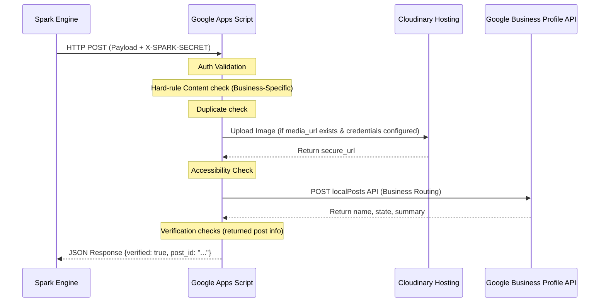

# AME Bazaar GMB Post Automation

Bespoke Google Business Profile (formerly GMB) webhook proxy built for AME Bazaar. This Google Apps Script-based application validates, hosts, publishes, and strictly verifies Google Business Profile updates triggered by Spark.

---

## 1. System Architecture

The automation follows a clean event-driven pipeline:

---

## 2. Core Components & Roles

### Spark Role
* Initiates the publishing process by making a POST request containing:
  * `request_id`: Unique identifier (UUID or hash) to enforce duplicate protection.
  * `business`: Key identifying target business profile (`AME_BAZAAR`, `MAHESHWARI_COUNSEL`, `ADVAITH_EDUCATIONAL_CENTER`, or `SIS`).
  * `summary`: Hinglish or English post text.
  * `media_url` (optional): Raw image link.
  * `cta_url` (optional): Learn more target.
* Passes authentication token in the HTTP request header `X-SPARK-SECRET`.

### Antigravity Role
* The AI Developer agent designing, refactoring, and maintaining the code.
* Performs local simulation tests using Node.js mock run environments.
* Manages continuous documentation and task lifecycle updates.

### Google Apps Script Web App Role
* Exposes a public webhook endpoint (`doPost`).
* Enforces mandatory properties validation and auth check.
* Routes posts to the corresponding business profile.
* Runs image uploads and accessibility pre-checks.
* Talks to Google Business Profile API to publish the post.
* Runs a strict post-publication verification and logs status.

---

## 3. Business-Specific Validation Gates

To ensure continuous local visibility and protect the reputation of each business, the script runs custom validation checks:

* **AME_BAZAAR**: Matches Hinglish style. Blocks unverified promotional claims like "cheapest" or "lowest price".
* **MAHESHWARI_COUNSEL**: Professional English. Restricts any legal solicitation terminology (e.g. "best lawyer", "guaranteed win").
* **ADVAITH_EDUCATIONAL_CENTER**: Restricts academic inventions (e.g. rank, percentile, 100% selection, board affiliation).
* **SIS**: Restricts school facility, admission, or board affiliation claims.

---

## 4. Data Flow & Security Protocols

### Image Hosting Flow
1. If `media_url` is provided, GAS checks for `CLOUDINARY_CLOUD_NAME` and `CLOUDINARY_UPLOAD_PRESET` script properties.
2. If available, it uploads the image to Cloudinary using their unsigned upload endpoint to get a robust public HTTPS URL.
3. If Cloudinary credentials are not present, it shares the file publicly via Google Drive and generates a fallback direct-download link.

### GBP API Flow
1. GBP OAuth tokens are refreshed using `GOOGLE_CLIENT_ID`, `GOOGLE_CLIENT_SECRET`, and `GOOGLE_GBP_REFRESH_TOKEN` to retrieve a temporary `Bearer` access token.
2. Payload containing `summary`, `callToAction`, and optional `media` is sent to `https://mybusiness.googleapis.com/v4/accounts/{accountId}/locations/{locationId}/localPosts` based on mapped business account/location IDs.

### Verification Flow
Once the post name is returned, GAS immediately performs a GET call to verify:
* Format: Post name matches `accounts/{accountId}/locations/{locationId}/localPosts/{postId}`.
* Content: Returned summary matches input text.
* Media: Image exists in GMB response if image was submitted.
* State: Post state is `LIVE` or `ACTIVE`.
* Response: Returns `verified: true` only if all verification checks pass.

### Duplicate Prevention
* Computes `contentHash = MD5(summary + media_url)`.
* Checks Script Properties for matching `dup_{request_id}` and `hash_{contentHash}`.
* If either exists, request is rejected.

---

## 5. Deployment Requirements

1. **Host as Web App**:
   * Deploy the script inside the Google Apps Script Editor.
   * Configuration: Execute as "Me", Access: "Anyone".
2. **Script Properties**:
   * Set all environment variables defined in `.env.example` under project Settings -> Script Properties. Set business-specific keys using `GOOGLE_GBP_ACCOUNT_ID_[BUSINESS_KEY]` syntax.
3. **Trigger Node Testing**:
   * Run local tests by installing devDependencies and running `npm test`.
